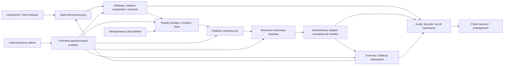

# Plan walki o podium — Goldman Sachs / HackYeah 2026

**Stan: 3.10.2026. Rekomendacja po analizie pięciu plików wejściowych. Brak implementacji i wyników testów na tym etapie.**

## 1. Decyzja, którą rekomenduję

Zbudujcie **ControlProof — AI Control Layer**: niewielki gateway z realnymi kontrolami, edytowalną polityką i panelem, w którym juror sam sprawdza skutki zmiany reguł. Główna obietnica: **„Zmień regułę. Powtórz żądanie. Zobacz, co naprawdę zostało wykonane.”** Nazwa robocza, bez badania dostępności marki.

Najgłębiej dopracujcie **limity budżetu przy równoległych wywołaniach**. Obok zróbcie mały, uczciwie ograniczony zestaw kontroli tożsamości, dostępu, danych i semantyki. Zadbajcie o audyt i wykonywalne testy od pierwszego przepływu. Jednorazową zgodę człowieka z ActionSeal dodajcie tylko po ukończeniu tej podstawy.

Dlaczego: pełny brief wymaga hybrydy reguł i AI, centralnej konfiguracji, budżetów, raportowania i testów. Jury może zmieniać reguły oraz używać własnych wejść. W takim konkursie przewagę daje kontrola, której działanie potraficie obronić, wraz z czytelnym dowodem. Efektowny agent finansowy nie jest ocenianym produktem. [S1, s. 2–4]

**Największe zagrożenie dla wyniku:** dopracować piękną demonstrację zatwierdzania eksportu, a zostawić atrapę detektora AI, licznik kosztów po fakcie i testy sprawdzające wyłącznie tekst `DENY`. Drugie zagrożenie: zbudować wiele kontroli, których można uniknąć jednym bezpośrednim wywołaniem backendu.

Nie znamy jakości innych zespołów ani kalibracji jury. To rekomendacja maksymalizacji jakości zgłoszenia przy ograniczonym czasie, nie gwarancja wygranej.

## 2. Co zmieniło się względem wcześniejszych materiałów

| Wcześniejsze założenie | Nowa informacja | Decyzja |
|---|---|---|
| ActionSeal jest najlepszym całym projektem | Brief wymaga większego rdzenia, a agent biznesowy nie jest oceniany | ActionSeal jako opcjonalna głęboka funkcja, nie zamiennik podstaw |
| Budżet można odłożyć i pokazać tylko liczbę kroków | Brief wielokrotnie wymienia zasoby, finanse i testy limitów | Realna rezerwacja przed wywołaniem w P0 |
| Warto rozwijać 2–3 projekty równolegle | Użytkownik wybrał GS i priorytet wygrania | Skupić ludzi na jednym zgłoszeniu GS |
| Nie znamy pełnych wag | Mamy dwie wersje, z rozbieżnością | Optymalizować pod wspólne kryteria, zapytać o wiążącą tabelę |
| Główny użytkownik to analityk KYC | Mentor wskazuje IT jako klienta warstwy | UI dla administratora i security; dokumenty klienta to demonstrator |
| MCP może być priorytetem | Mentor mówi o przykładzie, brief dopuszcza middleware/SDK | Jeden dobrze działający adapter; MCP dopiero gdy szybko integruje się ze stosem |
| HITL to świetny wyróżnik | Pozytywna reakcja mentora, brak formalnego obowiązku | Nie interpretować pochwały jako dodatkowej wagi w punktacji |

Starszy research zachowuje wartość w analizie obejść, tożsamości, zgód i dowodów wykonania. Nie trzeba budować onboardingowego produktu, żeby wykorzystać te wnioski. [S3–S5]

## 3. Pomysły porównane krytycznie

Ocena jakościowa względem **pełnego briefu** i pracy podczas hackathonu; nie prognoza punktów jury.

| Koncepcja | Co pokazujemy | Mocna strona | Słabość / koszt | Werdykt |
|---|---|---|---|---|
| **ControlProof: gateway + testowanie zmian polityki** | Zmiana roli/progu/budżetu, rzeczywisty przepływ, raport różnic | Szerokie pokrycie kryteriów, gotowość na własne próby jury | Łatwo zrobić sam dashboard; trzeba kontrolować realne adaptery | **Główny produkt** |
| **ActionSeal: zgoda na dokładną operację** | Zgoda, podmiana odbiorcy/załącznika, replay | Zapamiętywalne demo, dobry problem autoryzacji | Stan zgód, idempotencja i UI pochłaniają czas; sam pomysł nie pokrywa briefu | P1; pełny wariant tylko przy gotowym rdzeniu |
| **AgentSpend: limity odporne na równoległość** | 20 wywołań konkurujących o 5 rezerwacji | Obiektywny wynik, dobre testy, wyraźny związek z performance | Samodzielnie za wąski; dla realnych pieniędzy potrzebna znana górna granica kosztu | **Głęboka kontrola w ControlProof** |
| **ClientBoundary: granice danych i redakcja** | Analityk i reviewer widzą różny zakres, klient B niedostępny | Proste do zrozumienia, mocne pozytywne i negatywne przypadki | Regex nie wykrywa każdej poufnej treści; metadane muszą być zaufane | **Scenariusz główny i kontrola w P0** |
| **DelegationFirewall: zawężane prawa podagentów** | Dziecko nie zwiększa praw, wspólny budżet | Technicznie interesujące | Duży stan, dużo integracji, trudniejsze demo; brak wymogu delegacji | Odrzucić na ten zakres czasu |
| **Sam filtr prompt injection / sam monitor** | Kolor ryzyka lub wykres zdarzeń | Szybki start | Filtr można ominąć narzędziem, monitor nie blokuje, słaba oryginalność | Odrzucić jako samodzielny produkt |

Gateway i silniki polityk nie są nowym wynalazkiem. Dokumentacja OPA pokazuje kontekstową autoryzację HTTP. Wyróżnikiem proponowanego projektu jest spójny, łatwy do sprawdzenia zestaw: egzekwowanie, zmiany polityki, współbieżne budżety i dowody. Nie twierdzić, że gotowe produkty tego nie potrafią bez ich porównawczego testu. [W1]

## 4. Kryteria → konkretne dowody

| Kryterium | Brief / terms | Co ma zobaczyć juror |
|---|---:|---|
| Jakość guardrails i odporność | 30% / 30% | Kontrole przed skutkiem, brak drogi obejścia w pokazanym zakresie, awarie, legalne przypadki |
| Architektura i wydajność | 20% / 20% | Diagram granic zaufania, szybkie reguły, koszt detektora, p50/p95 i jawne ograniczenia |
| Raportowanie | 20% / 20% | Stan ochrony, aktywna polityka, przyczyny blokad, budżet, eksport audytu, wynik wykonawcy |
| Testy | 15% / 20% | Jedna komenda, przypadki allowed/blocked/redacted, równoległość, testy prawdziwego modelu |
| Wdrożenie i skalowanie | 15% / 10% | Start na drugim laptopie, jeden prosty adapter, zależności i instrukcja; uczciwa granica skalowania |

Źródła: [S1, s. 4; S2, pkt 11]. **Raportowanie + testy to 35–40% oceny**, więc nie mogą powstać w ostatniej godzinie. Innowacyjność nie ma tu odrębnych 30% ze starej ogólnej tabeli HackYeah.

## 5. Zakres P0 i definicja gotowości

P0 to docelowe minimum wiarygodnego zgłoszenia, nie obietnica, że wszystko da się napisać w kilka godzin.

| Element | Minimalna implementacja | Warunek akceptacji |
|---|---|---|
| Gateway | Jeden serwis HTTP z kontrolowanymi adapterami narzędzi i modelu | Dozwolone żądanie wykonuje narzędzie; odmowa przed wywołaniem daje licznik wykonawcy 0 |
| Tożsamość i ACL | Dwa konta demonstracyjne i oddzielny admin; klucz/sesja mapowana na użytkownika i agenta po stronie serwera | Zmiana `role` lub `client_id` w danych agenta nie przyznaje praw; brak tokenu odrzucony |
| Polityka | Walidowany YAML/JSON z wersją, progami, dozwolonymi modelami i limitami | Admin zmienia regułę bez restartu; następne żądanie i audyt używają nowej wersji |
| Dane | Zaufane metadane klienta i pól + redakcja określonych PII/sekretów | Dane innego klienta nie trafiają do modelu; niedozwolone pola są usunięte przed dalszym przekazaniem |
| Semantyka AI | Jeden działający lokalny detektor instrukcji w niezaufanej treści | Nowy prompt przechodzi przez prawdziwy model; próg steruje wynikiem; awaria widoczna i obsłużona |
| Budżet | Atomowe rezerwacje, liczba wywołań/tokenów, limit równoległości, timeout; dla API koszt według jawnego cennika adaptera | Test równoległości nie rozpoczyna operacji ponad limit; zużycie detektora też liczone |
| Feed zagrożeń | Wersjonowany zewnętrzny plik blokad ładowany przez kontrolę dopuszczania artefaktów | Zmiana feedu blokuje wcześniej dopuszczony testowy artefakt przed użyciem; odrzucenie niebezpiecznego formatu |
| Dashboard i audyt | Jeden ekran z kontrolami, decyzjami, wynikami, zużyciem i eksportem JSONL | Wartości pochodzą z backendu; eksport odtwarza scenariusz bez sekretów |
| Testy i pomiary | Testy mechanizmu + osobna ewaluacja AI + prosty benchmark | Wyniki rozróżniają stub/model rzeczywisty; testy błędów rzeczywiście wykrywają zepsutą kontrolę |
| Integracja | README, przykład klienta, start i reset danych demo | Druga osoba uruchamia całość zgodnie z instrukcją bez poprawiania kodu |

**P1 w kolejności:** precyzyjna jednorazowa zgoda ActionSeal; adapter MCP, jeśli podstawą jest HTTP; bogatsze porównanie dwóch polityk; dodatkowy detektor. Te pozycje nie są obowiązkowe i nie należy planować wszystkich.

**Poza zakresem:** pełny KYC/RAG, OCR, wysyłka prawdziwych maili, bankowe dane/API, płatności, autonomiczna delegacja, uczenie własnego modelu, Kubernetes, własny język polityk, marketplace narzędzi, certyfikacja zgodności. Nie dodawać wielkiego frameworka tylko po to, by pojawił się na diagramie.

## 6. Architektura i granice ochrony

Domyślnie Python/FastAPI + SQLite + prosty frontend w znanym zespołowi stosie. Jeden proces gatewaya ułatwia MVP; SQLite daje transakcje dla rezerwacji i audytu. Jeżeli zespół zdecydowanie lepiej zna TypeScript, przenieść projekt bez zmiany kontraktów. Nie wybierać Rust/Go wyłącznie dla domniemanej wydajności przed pomiarem.



Diagram upraszcza przepływ: **detektor ma własną rezerwację zasobów przed uruchomieniem**, chociaż na diagramie główny budżet jest po semantyce. Wywołanie detektora nie przechodzi rekurencyjnie przez ten sam detektor.

### Kolejność pojedynczej operacji

1. Ogranicz rozmiar wejścia, zweryfikuj tożsamość i schemat, przypnij poprawną wersję polityki.
2. Pobierz po stronie serwera uprawnienia użytkownika, agenta i zadania. Sprawdź ich przecięcie oraz narzędzie/model/zasób. Nie ufaj etykietom dopisanym przez model.
3. Wykonaj tanie kontrole deterministyczne. Twarde `DENY` kończy operację, bez kosztownej semantyki i narzędzia.
4. Zminimalizuj dane kierowane do detektora, zarezerwuj jego koszt/zasoby, wykonaj semantykę tylko tam, gdzie włączono ją w polityce. Zweryfikuj wynik według ścisłego schematu.
5. Po dopuszczeniu zarezerwuj budżet narzędzia/modelu w transakcji i wywołaj kontrolowany adapter. Nie utrzymuj transakcji SQLite przez czas inferencji.
6. Dla odpowiedzi narzędzia: zastosuj filtr danych i kontrolę niezaufanej treści **przed** wprowadzeniem jej do kontekstu agenta. Dla odpowiedzi modelu: kontrola przed przekazaniem odbiorcy.
7. Rozlicz znany wynik, zachowaj stan niepewnego kosztu przy timeoutcie, zapisz audyt i zaktualizuj panel.

Status decyzji: `ALLOW`, `DENY`, `REDACT`, później ewentualnie `REQUIRE_APPROVAL`. Oddzielny status skutku: `NOT_CALLED`, `STARTED`, `SUCCEEDED`, `FAILED`, `UNKNOWN`. Redakcja odpowiedzi po odczycie nie oznacza, że odczyt nigdy nie nastąpił.

### Zakres zaufania

Agent/model i treści wejściowe są niezaufane. Tożsamość, polityka, klasyfikacja i wykonawcy to część zaufana. Administrator systemu hosta jest poza modelem zagrożeń MVP.

Backend dokumentów nie ma dostępnego dla agenta klucza. Jeżeli osobny proces/backend wystawia port, potrzebuje uwierzytelnienia dostępnego tylko gatewayowi i testu obejścia. Jeżeli adapter działa w procesie gatewaya, opisać, że złośliwy kod z tymi samymi uprawnieniami nie jest izolowany. Sam adres `localhost` ani wrapper SDK nie dowodzą izolacji.

Podstawowa ochrona obejmuje wyłącznie podłączone adaptery. Nie przechwytuje magicznie całej sieci, plików i innych aplikacji użytkownika. Zasada minimalnych uprawnień, walidacja wejść i wyjść oraz traktowanie wyników narzędzi jako niezaufanych są zgodne z kierunkiem OWASP; konkretna architektura powyżej jest naszą propozycją. [W2]

## 7. Głęboka kontrola: budżet, który wytrzymuje równoległość

**Niezmiennik:** `spent + reserved <= limit` w obrębie jednego zaufanego identyfikatora zadania. Rezerwacje są atomowe, koszt wyrażony jako integer w najmniejszej jednostce, bez błędów `float`. Utworzenie nowych identyfikatorów żądań nie tworzy nowego budżetu. Zakładanie zadań podlega limitowi użytkownika, żeby nie omijać ochrony mnożeniem zadań.

Każda próba ma ID i przechodzi `RESERVED → SETTLED` albo `RESERVED → UNKNOWN`. Rezerwację zwalniamy, gdy wiadomo, że operacja nie została wysłana lub znamy mniejszy rzeczywisty koszt. Timeout po wysłaniu oznacza `UNKNOWN`: zachowujemy konserwatywną rezerwację do wyjaśnienia. Restart nie zeruje stanu SQLite.

**Próba demonstracyjna:** limit 500 jednostek testowych, każda z 20 równoległych operacji rezerwuje 100, a rozliczenie celowo czeka za barierą. Dokładnie 5 może wejść do adaptera, 15 otrzymuje odmowę budżetu. W osobnym profilu tego testu ustaw limit równoległości co najmniej 20 i wyłącz semantykę dla tego bezpiecznego narzędzia, żeby inny limit ani koszt detektora nie zmieniły oczekiwanego wyniku. Pozostałe kontrole dla tego testu nie mogą stać się wcześniejszą przyczyną odmowy. Po zakończeniu pokażcie sumę i licznik wywołań wykonawcy. Jednostki testowe są oznaczone jako symulacja, a nie rzeczywiste PLN.

**Komercyjne API:** rezerwuj sprawdzoną górną granicę kosztu wejścia + ograniczonego wyjścia + znanych opłat narzędzia, z cennikiem wersjonowanym w adapterze. Wymuś model i maksymalną liczbę tokenów. Bez znanej granicy kosztu nie deklaruj twardego limitu pieniędzy. Gdy nie macie własnego API, pokażcie deterministyczny adapter o określonym kontrakcie kosztu i jawnie nazwijcie go testowym; potwierdźcie z mentorem, czy taki dowód wystarcza.

**Model lokalny:** licz wywołania, wejściowe i wyjściowe tokeny, równoległość oraz czas żądania. Limit oczekiwania HTTP nie musi zatrzymać inferencji po stronie serwera. Jeśli backend nie daje skutecznego anulowania, nie deklaruj twardego limitu czasu GPU: zatrzymaj następne żądania i pokaż trwające jako nierozliczone. Lokalny model nie jest „bez kosztu”; po prostu koszt nie musi być fakturowany per token.

Koszt detektora, ponowienia i błędy są widoczne osobno. Wszystkie drogi wywołania tego samego adaptera korzystają ze wspólnego licznika.

## 8. Kontrola AI bez pozorowania jakości

Wybrać **jeden** dostępny model/detektor po próbie na docelowym laptopie. Użyć lokalnego endpointu lub klasyfikatora, z przypiętą wersją i sprawdzoną licencją. „Jeff” pozostaje kandydatem wyłącznie po ustaleniu, czym jest i czy działa. Nie trenować modelu podczas hackathonu.

Kontrakt: `risk_score`, `category`, krótki powód, identyfikator modelu/wersji; żadnych narzędzi dostępnych dla detektora. Jeśli model generuje JSON, brak poprawnego JSON-a jest błędem kontroli. Wejście powyżej obsługiwanego limitu jest odrzucane lub jawnie kierowane do innej ścieżki; nie ucinać po cichu końca z potencjalnym atakiem.

Próg 0.80 oznacza próg na skali detektora, **nie 80% prawdopodobieństwa ataku**. Dla jednego otrzymanego wyniku można porównać dwie polityki bez ponownej inferencji; UI musi oznaczać taki podgląd jako re-ewaluację zapisanego wyniku. Następnie wykonać nową próbę na żywo. Nie hardkodować score dla przycisków demo.

Przygotować minimum 12 nowych próbek: 6 normalnych i 6 prób manipulacji, w tym cytat opisujący atak w celach edukacyjnych, parafraza bez słów „ignore previous instructions”, polski i angielski tekst, polecenie w wyniku narzędzia. To mała ewaluacja lokalna, nie dowód ogólnej skuteczności. Rozdzielić przykłady do ustawienia progu od próbek sprawdzających. Raportować false positives i false negatives, model, wersję, sprzęt i liczbę przypadków.

**Bramka po pierwszej godzinie:** model działa na sprzęcie i zwraca wyniki dla nowych wejść. Jeśli nie, zmienić model na dostępny lub użyć własnego API po potwierdzeniu zasad. Stub pozostaje narzędziem testowania mechanizmu; nie zastępuje hybrydy w gotowym zgłoszeniu.

## 9. Historyczne zagrożenie i zmienny feed

Najmniejszy wiarygodny zakres: kontrola dopuszczania artefaktów, np. danych pamięci/agenta lub pliku modelu. Kontrolowane narzędzie `admit_artifact` przyjmuje ID pliku z katalogu testowego; gateway sam odczytuje plik, liczy SHA-256, sprawdza zaufany manifest, dozwolony format i feed blokad. Agent nie podaje wiarygodnego hasha ani klasyfikacji pliku.

- Dopuszczony, niezmieniony plik JSON z ograniczonym schematem przechodzi do testowego adaptera.
- Pickle i inne formaty wymagające wykonywania kodu są zatrzymywane przed deserializacją. Nie wystarczy sprawdzić rozszerzenie; dopuszczany JSON rzeczywiście przechodzi parser i walidację.
- Admin dopisuje hash bezpiecznej próbki do feedu. Po przeładowaniu ta sama próbka jest blokowana, a audyt podaje ID i wersję reguły. To test mechanizmu dystrybucji blokady, nie realny malware.
- Historyczne tło: PyTorch opisał kompromitację zależności `torchtriton` w grudniu 2022, opublikował hash złośliwego pliku i wskazał ryzyko wykradania danych. Można dołączyć prawdziwy historyczny IOC jako rekord informacyjny oraz test dopasowania wartości; nie pobierać malware i nie udawać testu jego wykonania. [W3]
- Niebezpieczeństwo wykonania kodu przy wczytaniu niezaufanego pickle opisuje Hugging Face. Nasze demo pokazuje zakaz tej klasy operacji, nie pełny skaner bezpieczeństwa modeli. [W4]

Feed: `feed_version`, `rule_id`, `kind`, `value`, `source`, `reason`, `is_test_fixture`. Ładowany z osobnego pliku zarządzanego przez admina, bez kodu wykonywalnego i dowolnych wyrażeń. Zmiana feedu nie wymaga zmiany aplikacji. Dla hackathonu plik reprezentuje zewnętrzne zarządzanie; integracja z rzeczywistym dostawcą threat intelligence jest poza MVP.

**Granica:** gateway nie wykryje instalacji złośliwej zależności poza kontrolowaną ścieżką. Nie reklamować demonstracji jako odtworzenia incydentu PyTorch lub ochrony całego supply chain. Jeżeli mentor oczekuje konkretnego CVE zamiast bezpiecznej demonstracji klasy zagrożenia, to wymaga doprecyzowania zakresu.

## 10. Polityka, którą jury może zmienić

Poniżej **projekt schematu**, nie istniejąca konfiguracja ani gotowy kod. Wartości to dane demonstracyjne.

```yaml
schema_version: 1
policy_version: demo-v1
default_decision: deny
controls:
  access: {enabled: true}
  pii: {enabled: true, action: redact}
  semantic:
    enabled: true
    block_threshold: 0.80
    on_error: deny
    max_input_chars: 12000
models:
  allowed: [local-demo-model]
resources:
  max_calls_per_task: 20
  max_concurrency_per_task: 2
  max_output_tokens: 512
  request_timeout_ms: 5000
budget:
  unit: test_credit
  limit_per_task: 500
feed:
  path: ./config/threat-feed.json
audit:
  store_raw_content: false
```

Do tego dokumentowane sekcje ACL: użytkownik/agent → narzędzia, klienci, pola i odbiorcy. Prawdziwy identyfikator modelu wstawić po próbie sprzętu; ceny i granice kosztu muszą pochodzić z adaptera/cennika, nie z argumentów agenta. Walidować zależności wartości i nieznane pola. Nie przyjmować dowolnego URL feedu od agenta.

Zmianę aktywuje uprawniony admin przez „Validate & Apply” lub lokalny reload. Nowa wersja działa od następnego żądania. Błędny plik zostawia ostatnią poprawną wersję i pokazuje błąd; pierwszy start bez poprawnej polityki nie przepuszcza ruchu. Po zmniejszeniu budżetu poniżej obecnych zobowiązań zatrzymać nowe wywołania i pokazać przekroczenie nowego limitu, nie zmieniać historii kosztów.

Porównanie „controls off” uruchamiać tylko na syntetycznych danych i testowych adapterach, w osobnym profilu laboratoryjnym. Nie wyłączać uwierzytelnienia panelu admina. Wyłączona kontrola powinna być widoczna jako brak ochrony, a nie zielony stan systemu.

## 11. Dashboard: jeden ekran, dwie perspektywy

**Górny pasek dla managementu:** aktywna wersja polityki, liczba dozwolonych/odrzuconych/zredagowanych operacji, spent/reserved/unknown, opóźnienie p95, status detektora i feedu. Przy małej próbce pokazać liczbę pomiarów. Nie pokazywać arbitralnego „security score 98/100”.

**Panel kontroli:** włączone reguły, progi, budżet, dozwolone modele, walidacja i aktywacja zmian. Wystarczy kilka pól plus podgląd YAML; nie budować rozbudowanego edytora.

**Oś zdarzeń dla security:** użytkownik/agent/task, narzędzie, faza kontroli, decyzja, reason code, wersje, czas, rzeczywisty stan wykonania i licznik adaptera. Widok szczegółów pokazuje bezpieczne różnice po redakcji oraz rezerwację/rozliczenie.

**Panel testów:** uruchom przypadki, pokaż oczekiwany i rzeczywisty wynik, oddziel reguły deterministyczne od modelu AI. Przed/po można początkowo zestawić w prostej tabeli, bez osobnego silnika odtwarzania zdarzeń.

Eksport JSONL/CSV jest z tego samego magazynu co dashboard. Surowe tokeny, PII, dokumenty i pełne prompty nie trafiają do zwykłych logów. Syntetyczny podgląd treści demo oddzielić od logów. Każdy event ma co najmniej `request_id`, `task_id`, `principal_id`, `agent_id`, `control_id`, `decision`, `reason_code`, `policy_version`, `feed_version`, `model_version`, `enforcement_stage`, `execution_status`, `latency_ms`, `budget_delta`.

## 12. Testy, których nie da się zastąpić zielonym ekranem

Planowana komenda: `make verify` — do zaimplementowania. Ma uruchamiać testy mechanizmu oraz testy rzeczywistej integracji; brak modelu nie może być cichym sukcesem. Osobne `make test` może działać bez modelu i jawnie raportować zakres. Każdy test ma setup/reset, expected decision, expected reason i dowód skutku. Poniższe wiersze to grupy przypadków, nie wykonane wyniki.

| ID | Próba | Oczekiwany dowód |
|---|---|---|
| T01 | Poprawna tożsamość, legalny odczyt A | `ALLOW`, adapter wywołany, poprawny wynik |
| T02 | Brak / błędny / wygasły token, jeśli stosujecie TTL | Odmowa uwierzytelnienia, zero wywołań |
| T03 | Agent podaje `role=admin` | Rola serwerowa bez zmian, brak rozszerzenia uprawnień |
| T04 | Zadanie A próbuje czytać klienta B | `DENY`, dane B nie występują w wejściu modelu ani audycie |
| T05 | Analityk i reviewer odczytują A | Poprawne, różne zakresy pól; żadna rola nie zyskuje dostępu do B |
| T06 | PII i syntetyczny sekret w wyniku narzędzia | `REDACT` przed modelem, brak wartości w promptcie, UI i logach |
| T07 | Nieszkodliwy tekst podobny do wzorca PII | Oczekiwane zachowanie opisane; zmierzona liczba fałszywych blokad |
| T08 | Niedozwolony model / nieznane narzędzie / dodatkowy argument | Odmowa przed adapterem i kosztem |
| T09 | Bezpośrednia próba backendu z uprawnieniami agenta | Brak wykonania poza gatewayem w pokazanym środowisku |
| T10 | Jawna i sparafrazowana injection, także w tool output | Wynik prawdziwego detektora; nieudane wykrycia jawne w ewaluacji |
| T11 | Legalny cytat o atakach | Nie traktować automatycznie tematu security jako ataku; wynik w false-positive rate |
| T12 | Score poniżej, równy i powyżej progu | Reguła graniczna `score >= threshold` daje przewidywalny wynik; stub oznaczony |
| T13 | Timeout / błędny JSON / niedostępny detektor | `DENY` lub jawny błąd, bez wykonania chronionego narzędzia |
| T14 | Zbyt długie wejście z atakiem na końcu | Odrzucenie limitu, brak cichego skrócenia i przepuszczenia |
| T15 | Operacja w limicie, dokładnie na granicy, ponad limitem | Poprawne rezerwacje i odmowa przed kosztem |
| T16 | 20 równoległych żądań przy budżecie na 5 | Przy ustalonym setupie 5 wejść do wykonawcy, brak przekroczenia |
| T17 | Równoległość / pętla / próby pod nowymi request ID | Wspólny task budget i limit kroków pozostają skuteczne |
| T18 | Błąd przed wysłaniem oraz timeout po wysłaniu | Pierwszy bez zużycia; drugi `UNKNOWN`, bez nieuzasadnionego zwrotu rezerwacji |
| T19 | Restart przy aktywnych rezerwacjach | Budżet zachowany, nierozliczone operacje nie znikają |
| T20 | Zmiana progu, budżetu i dozwolonego modelu | Następne żądania zachowują się według nowej wersji; wyniki nie są zakodowane w UI |
| T21 | Błędna polityka / niedozwolona zmiana przez agenta | Odrzucona zmiana, ostatnia poprawna wersja pozostaje aktywna |
| T22 | Brak polityki podczas pierwszego startu | Brak obsługi chronionych operacji |
| T23 | Poprawny artefakt i próba niedozwolonej deserializacji | Dopuszczenie bezpiecznego; odrzucenie niebezpiecznego formatu przed użyciem |
| T24 | Dopisanie hasha do feedu / uszkodzony feed | Nowa blokada działa; błędna aktualizacja nie usuwa poprzednich ochron |
| T25 | Manipulacja bajtami artefaktu lub deklarowanym hashem | Serwer wykrywa niezgodność z manifestem; pole od agenta niczego nie autoryzuje |
| T26 | Pełny audyt sukcesu, blokady, redakcji i timeoutu | Różne prawdziwe stany, kompletne powiązanie, brak sekretów |
| T27 | Ta sama syntetyczna operacja bez i z kontrolą | Różnica w wyniku adaptera, nie tylko w kolorze interfejsu |
| T28 | Nowe wejście ręcznie przygotowane przez osobę spoza implementacji | System przyjmuje dowolne poprawne wejście i egzekwuje regułę |

Przynajmniej jeden test każdej kontroli musi wykryć jej celowe wyłączenie/uszkodzenie w kopii testowej. To prosty sposób sprawdzenia jakości testów, nie obowiązek budowania całego frameworka mutation testing.

Jeżeli dochodzi P1 ActionSeal: legalna zgoda, brak uprawnień zatwierdzającego, podmiana parametrów/treści, wygaśnięcie, replay, dwa równoległe użycia oraz odwołanie uprawnień. Zgoda dotyczy dokładnych bajtów/wersji i parametrów, jest zużywana atomowo, a wykonawca ponownie sprawdza prawa. Człowiek nie może zatwierdzeniem obejść twardego zakazu. Przy niepewnym skutku zewnętrznym nie deklarować „exactly once”.

## 13. Wydajność i dowód wartości

Benchmark na tym samym laptopie, tych samych danych i adapterze: bez warstwy, z regułami, z regułami i detektorem. Osobno rozgrzewka i zimny start. Proponowana próba: 100 żądań regułowych, 20 semantycznych oraz seria współbieżna, o ile mieści się w czasie i zasobach. To liczebności planowane.

Raport: p50/p95 czasu kontroli, czas modelu, end-to-end, throughput, liczba błędów i prób, CPU/RAM jeśli dostępne, koszt guardów, licznik wykonawcy. Przy małej próbce nie przeceniać p95. LLM nie może być pominięty z wykresu hybrydy, a timeouty nie mogą znikać z mianownika.

Roboczy cel inżynieryjny: narzut samej ścieżki deterministycznej p95 < 20 ms na laptopie demo. To cel do sprawdzenia, nie deklarowany wynik ani wymaganie jury. SLA semantyki ustalić po pierwszej próbie sprzętu.

Dowód użyteczności: legalne zadania nadal kończą się sukcesem, administrator rozumie przyczynę odmowy, nową kontrolę można wpiąć przez jeden interfejs, a integracja przykładowego klienta wymaga małej, pokazanej zmiany. Nie liczyć „zaoszczędzonych pieniędzy” jako dowolnej liczby zablokowanych promptów pomnożonej przez hipotetyczną cenę.

## 14. Podział pracy i harmonogram

**Założenie robocze:** 3 osoby techniczne + 1 osoba prowadząca scenariusze, mentoring i zgłoszenie, zgodnie ze starszym researchem. To niepotwierdzone; imion nie przypisuję bez znajomości kompetencji. Role oznaczają ludzi w zespole, nie uruchomione agenty AI.

| Właściciel | Zakres | Pierwszy dowóz |
|---|---|---|
| A — backend / integrator | Gateway, tożsamość, ACL, polityki, adaptery | Legalny odczyt i odmowa przed adapterem |
| B — kontrola AI i budżet | Detektor, filtrowanie, rezerwacje, pomiary | Działający model na sprzęcie i test atomowego limitu |
| C — jakość i panel | Kontrakt audytu, test runner, feed/artefakty, prosty frontend | Test HTTP sprawdzający skutek i panel prawdziwych zdarzeń |
| D — scenariusze i zgłoszenie | Pytania do organizatora, niezależne wejścia, opis, PDF, próby | Potwierdzone terminy + lista przypadków z oczekiwanym wynikiem |

C ma największe ryzyko przeciążenia. Po pierwszym przepływie A pomaga przy artefaktach, B przy testach swojej kontroli. D nie musi znać security, żeby sprawdzić, czy legalny przypadek działa i czy zgłoszenie tłumaczy wynik. Jeśli nie ma D, zarezerwować wspólnie czas na materiały; nie zakładać, że „zrobią się same”.

### Pierwsze 30 minut po wyborze zakresu

1. D potwierdza deadline/start, checkpoint, wagi i oczekiwania historycznego exploitu. Nie czekać z planowaniem na odpowiedź.
2. A, B, C ustalają wspólny kontrakt `RequestContext`, `ControlResult`, `AuditEvent` i nazwy reason codes; zapisują w README/specyfikacji.
3. B sprawdza prawdziwy model na docelowym laptopie; podaje opóźnienie i zapotrzebowanie na pamięć.
4. A stawia minimalny adapter odczytu; C pisze test efektu dla allow/deny. D przygotowuje syntetyczne dokumenty A/B i oczekiwane zachowanie ról.
5. Wybrać jeden wspólny sposób uruchomienia i integracji; dalsze decyzje o stacku zamknąć po tej próbie.

### Plan na około 18 godzin od rozpoczęcia implementacji

H0 oznacza rzeczywisty, potwierdzony jako dozwolony moment rozpoczęcia implementacji. Harmonogram nie rozstrzyga sprzeczności PM/AM w regulaminie. Przy rozpoczęciu około 14:30 w sobotę i potwierdzonym deadline 11:00 w niedzielę daje bufor na zgłoszenie. Czasy obejmują przerwy i integrację; nie są obietnicą 18 godzin nieprzerwanej pracy każdej osoby.

| Okno | Cel zespołu | Bramka / decyzja |
|---|---|---|
| H0–H1 | Kontrakty, sprzęt/model, źródła prawdy, minimalna polityka | Model faktycznie odpowiada; brak tej ścieżki → natychmiast zmiana wyboru modelu |
| H1–H3 | Pionowy przepływ: auth → ACL → adapter → audyt → test → prosty panel | **G1:** allowed i denied z dowodem wywołania; bez tego usuwamy P1 |
| H3–H6 | Semantyka, redakcja przed modelem, budżet i testy współbieżności | **G2:** prawdziwa hybryda i limit działają; mentor ogląda 3-minutowe demo |
| H6–H9 | Reload polityki/feedu, kontrola artefaktów, awarie i eksport audytu | **G3:** wszystkie rodziny P0 mają działającą ścieżkę; w przeciwnym razie zero rozszerzeń |
| H9–H12 | Integracja testów, niezależne próby D, benchmark, poprawki | **G4:** obrona przed zmianami konfiguracji i nowymi wejściami; zamrożenie funkcji |
| H12–H15 | README, clean start na drugim laptopie, PDF ≤10 slajdów, nagranie zapasowe | **G5:** osoba spoza kodowania uruchamia instrukcję i rozumie wynik |
| H15–H18 | Próby pitchu, poprawki krytyczne, ostateczny test i eksport wyników | **G6:** gotowy pakiet, zgłoszenie z zapasem; bez nowych funkcji |

Po G3 można rozważyć **jedno** P1 wyłącznie jeśli pozostaje co najmniej 6 godzin, testy podstaw przechodzą i jest odrębny właściciel. Nie planować P1 kosztem G4–G6.

Przy mniej niż 12 godzinach: statyczny panel z prostym odświeżaniem, HTTP zamiast MCP, dwa dokumenty zamiast sześciu, jeden detektor, jeden format feedu, zero HITL. Zachować testy, model, rzeczywistą kontrolę zasobów i minimum raportowania. Jeśli to nadal niewykonalne, jawnie wskazać luki w briefie i skonsultować zakres; nie zastępować działania atrapą.

Przy dwóch programistach: A bierze gateway/politykę/artefakty, B detektor/budżet/testy, UI minimalny generowany z backendu; osoba nietechniczna prowadzi scenariusze i zgłoszenie. Przy jednej osobie zakres pełnego P0 ma wysokie ryzyko — konieczne drastyczne uproszczenie interfejsu i wykorzystanie znanych komponentów.

## 15. Demo, które broni projekt

Przygotować wersję 90-sekundową i 4-minutową; długość oficjalnego pitchu jest niepotwierdzona. Wszystkie dane syntetyczne, backend klienta i odbiornik wyraźnie oznaczone jako demonstracyjne. Tryb skryptowych tool calls jest jawny i osobny od próby z żywym agentem/modelami.

**Pełna wersja:**

1. **0:00–0:30 — szkoda i granica.** To samo zadanie w izolowanym profilu bez wybranej kontroli ujawnia syntetyczne pole lub zużywa więcej zasobów. Widać realny wynik adaptera.
2. **0:30–1:10 — legalna praca.** Włączona polityka: poprawny odczyt A działa, pola analityka są redagowane, konto reviewera widzi dozwolony szerszy zakres. Odczyt B zostaje zablokowany przed modelem.
3. **1:10–1:50 — hybryda.** Niezaufana treść z instrukcją trafia do detektora. Pokaż score, próg i wynik; zmiana progu zmienia decyzję semantyczną, ale nie omija ACL. Nowa próba na żywo może pochodzić od jurora.
4. **1:50–2:35 — trudny dowód.** Uruchom 20 równoległych żądań w izolowanym teście budżetu. Pokaż rezerwacje i dokładnie 5 wywołań przy limicie testu; reszta nie dochodzi do wykonawcy.
5. **2:35–3:10 — zmienna polityka i feed.** Admin zmienia regułę lub feed; następne żądanie ma nową wersję i inne zachowanie. Błędna konfiguracja daje błąd, bez wyłączenia ochrony.
6. **3:10–4:00 — dowód i wdrożenie.** Test suite, wyniki ewaluacji AI, p95, eksport audytu i krótki przykład integracji. Wyjaśnijcie jedno ograniczenie zakresu, zanim juror je odkryje.

Każdy segment używa osobnego task ID i świeżego stanu, żeby wcześniejsze wyczerpanie budżetu nie udawało skuteczności filtra. W 90 sekundach: legalny przebieg, jedna zmiana polityki, równoległy limit i wynik testów. P1 zgody zastępuje jeden segment, nie wydłuża pokazu.

Awaria internetu: lokalny model, pobrane zależności i dane. Awaria sprzętu: drugi laptop sprawdzony wcześniej oraz krótkie nagranie z oznaczoną wersją projektu. Nagranie nie zastępuje wymaganego wykonywalnego zestawu testów.

### Pytania jury, na które trzeba umieć odpowiedzieć

- **„Co jeśli detektor się pomyli?”** Twarde reguły nadal ograniczają uprawnienia i budżet; pokazujemy false positives/negatives. Detektor nie jest gwarancją.
- **„Czy mogę obejść proxy?”** Pokazujemy test dostępu do backendu i dokładną granicę izolacji. Kanały poza integracją pozostają poza deklaracją ochrony.
- **„Czy to tylko zwykły proxy?”** Proxy jest wzorcem; wartością ocenianą są kontrole, ich zmiana, dowody działania, zużycie i łatwość integracji.
- **„Czy budżet działa po restarcie i równolegle?”** Odpowiadamy wynikiem testów trwałych rezerwacji, nie samym diagramem.
- **„Jak to skalować?”** MVP to jeden gateway i SQLite. Następny krok: współdzielony transakcyjny magazyn limitów, dystrybucja wersji polityki, kolejki i obserwowalność; bez deklaracji już zmierzonej skali produkcyjnej.
- **„Czy umiecie zatrzymać już rozpoczęty model?”** Odróżniamy brak kolejnych wywołań, timeout klienta i rzeczywiste anulowanie po stronie backendu.

## 16. Materiały zgłoszenia

Regulamin zadania wymaga tytułu, nazwy i składu zespołu (1–6), opisu oraz PDF do 10 slajdów; HackTribe, PL lub EN. Przygotować EN, zgodnie także z wcześniejszą kartą zadania. Limity 5 słów tytułu / 500 słów opisu / obraz galerii / checkpoint 20:00 pochodzą ze starszego researchu ogólnego — sprawdzić w aktualnym formularzu. [S2, pkt 5; S4]

Proponowane **9 slajdów**, samodzielnie zrozumiałych w etapie pierwszym:

1. Problem IT i jedno zdanie rezultatu, obok rzeczywisty kadr decyzji i skutku.
2. Co kontrolujemy: granice zaufania i syntetyczny scenariusz.
3. Diagram i krótki sposób wpięcia klienta.
4. Kontrole deterministyczne + semantyczne; przykład legalny i nielegalny.
5. Pogłębiony dowód budżetu: równoległość, rezerwacje, timeout.
6. Zmiana polityki/feedu na żywo i wynik przed/po.
7. Raportowanie: management + audyt security, bez surowych sekretów.
8. Rzeczywiste wyniki testów i wydajności z liczebnością, sprzętem i ograniczeniami.
9. Uruchomienie, repo/demo, zakres dalszego wdrożenia, zespół i użyte komponenty/AI/licencje.

Do repo: opisany plik polityki, feed z pochodzeniem sygnatur, diagram, instrukcja uruchomienia i testów, syntetyczne dane, przykładowy klient, wynik benchmarku i ewaluacji, lista zależności/licencji. Instrukcja jasno rozdziela testy offline od rzeczywistej semantyki.

**D−3 h:** zamrozić funkcje. **D−2 h:** pełna próba uruchomienia i przegląd PDF. **D−60 min:** wysłać gotowy pakiet. **D−30 min:** sprawdzić status zgłoszenia, załączniki i dostęp do linków; zachować potwierdzenie. D to potwierdzony deadline. Po D nie zmieniać zgłoszonego rozwiązania; zachować oznaczoną wersję i pliki. [S2, pkt 13]

## 17. Niewiadome do rozstrzygnięcia

| Pytanie | Dlaczego ważne | Domyślne działanie do odpowiedzi |
|---|---|---|
| Jaki jest dozwolony start i deadline: 11:00 czy 23:00? Czy checkpoint to sobota 20:00? | Konflikt dokumentów może unieważnić harmonogram | Planować bufor do wcześniejszego końca; godziny i prawo rozpoczęcia potwierdzić na miejscu |
| Która tabela wag obowiązuje: 15/15 czy 20/10 dla testów/wdrożenia? | Dwa oficjalne PDF-y nie są zgodne | Zachować mocne testy i łatwy start w obu wariantach |
| Czy akceptujecie klasę zagrożenia + bezpieczny test feedu, czy wymagacie demonstracji konkretnego CVE? | Wymóg historycznych exploitów ma otwartą głębokość | Zaplanowany artefakt gate z jasno opisaną granicą |
| Czy lokalny detektor i testowy adapter komercyjnego kosztu wystarczą, czy potrzebne jest rzeczywiste płatne API? | Brak dostarczanych subskrypcji, własne zasoby nieznane | Model lokalny realny; test finansowy jawnie syntetyczny |
| Czy skład nadal wynosi 3 techniczne + 1 osoba nietechniczna? Jaki stack i sprzęt? | Wykonalność i podział | Role A/B/C/D i Python są założeniem, nie przypisaniem osób |
| Ile minut trwa prezentacja i czy jury uruchamia projekt na swoim sprzęcie? | Forma pakietu i ryzyko instalacji modelu | Dwie długości demo, instrukcja, drugi laptop i lokalne zależności |

Nie ma potrzeby ponownie pytać mentora, kto jest klientem, czy wolno użyć gotowego agenta albo czy MCP jest jedyną drogą — materiały już to wyjaśniają. W kolejnej rozmowie pokazać działający przepływ i zapytać, czego brakuje do kryteriów.

## 18. Źródła, zakres lektury i status

Przeczytano w całości wszystkie pięć merytorycznych plików w katalogu, w tym 7 stron obu PDF-ów; PDF-y sprawdzono także wizualnie. Nie analizowano treści plików przywołanych w researchu, których nie ma w tym katalogu. `.DS_Store` pominięto jako metadane systemu.

- **S1:** [opis_tasku.pdf](opis_tasku.pdf) — zakres, deliverables, ocena; szczególnie s. 2–4.
- **S2:** [terms.pdf](terms.pdf) — pkt 5: termin i zgłoszenie; pkt 7: nagrody; pkt 8: etapy; pkt 11: wagi; pkt 13–14: termin zmian i prawa.
- **S3:** [rozmowa.txt](rozmowa.txt) — IT jako klient, kontrol catalog, zmienne progi, demo, integracja, opcjonalny dynamic access control i jedna kontrola pogłębiona.
- **S4:** [HACKYEAH_2026_RESEARCH.md](HACKYEAH_2026_RESEARCH.md) — wcześniejsza strategia wydarzenia; informacje niepotwierdzone aktualnie oznaczone w planie.
- **S5:** [GOLDMAN_SACHS_PROBLEMY_I_ROZWIAZANIA.md](GOLDMAN_SACHS_PROBLEMY_I_ROZWIAZANIA.md) — wcześniejsze hipotezy i pomysły; szczególnie rozdziały 6, 9, 11–15.
- **W1:** [OPA — HTTP API authorization](https://www.openpolicyagent.org/docs/http-api-authorization) — sprawdzono 3.10.2026; istniejący wzorzec zewnętrznej oceny reguł.
- **W2:** [OWASP — MCP Security Cheat Sheet](https://cheatsheetseries.owasp.org/cheatsheets/MCP_Security_Cheat_Sheet.html) — sprawdzono 3.10.2026; minimum uprawnień, walidacja, niezaufane wyniki narzędzi, izolacja i monitoring.
- **W3:** [PyTorch — Compromised nightly dependency](https://pytorch.org/blog/compromised-nightly-dependency/) — pierwotny opis incydentu 25–30.12.2022; sprawdzono 3.10.2026.
- **W4:** [Hugging Face — Pickle Scanning](https://huggingface.co/docs/hub/security-pickle) — sprawdzono 3.10.2026; ryzyko wykonania kodu przy deserializacji.

Próba aktualnej weryfikacji strony regulaminu/guide HackYeah nie dała czytelnej treści, a tekstowa karta zadań pokazała tylko ładowanie. Nie potwierdzono przez to terminu ani wiążącej tabeli wag. Strona i starszy research nie zostały użyte do arbitralnego rozstrzygnięcia sprzeczności lokalnych PDF-ów.

**Status końcowy tej analizy:** koncepcja i plan przygotowane; implementacja, model, testy, wyniki, prezentacja konkursowa i zgłoszenie pozostają pracą do wykonania. Pierwsza decyzja zespołu: potwierdzić zasoby i terminy, następnie zbudować pionowy przepływ ControlProof.
