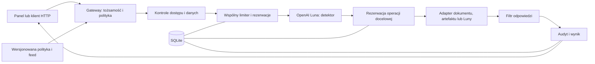

# Wspólne ustalenia techniczne

**Wersja 1, 3.10.2026.** Specyfikacja do implementacji dla dwóch osób. Konkretne wybory poniżej zastępują warianty ze starszych planów. Działanie API, dostępność modelu na koncie i osiągi nie zostały jeszcze przetestowane.

Kolejność pracy: [plan](PLAN_DWOCH_OSOB.md). Właściciele plików i sposób wprowadzania zmian: [CONTRIBUTING](../CONTRIBUTING.md).

## 1. Co budujemy i co oboje musicie rozumieć

ControlProof jest serwerem kontrolującym dostęp do podłączonych narzędzi i modeli. Użytkownikiem panelu jest IT/security. Dokumenty klientów A/B są syntetycznym przykładem użycia.

| Pojęcie | Znaczenie w naszym projekcie |
|---|---|
| Gateway | Jedyny publiczny punkt wykonywania chronionych operacji |
| Adapter | Kod odczytujący dokument, przyjmujący artefakt albo wywołujący model |
| Polityka | Wersjonowana konfiguracja: kto, do czego, z jakimi limitami |
| Kontrola deterministyczna | Kod dający wynik na podstawie reguły, np. porównania właściciela dokumentu |
| Kontrola semantyczna | Model oceniający sens tekstu, np. próbę podsunięcia instrukcji |
| Redakcja | Usunięcie wskazanych pól/wzorców przed dalszym przekazaniem danych |
| Rezerwacja | Zajęcie części dostępnego budżetu przed rozpoczęciem operacji |
| Audyt | Zapis decyzji, powodu, wersji reguł i rzeczywistego skutku |

Zakres podstawowy: dostęp, redakcja, jeden detektor AI, budżet, feed artefaktów, panel, audyt i testy. Głębiej dopracowujemy budżet przy równoległych wywołaniach. Jednorazowe zgody człowieka i MCP mogą powstać dopiero po ukończeniu podstaw; nie są zależnością żadnego kroku.

## 2. Technologie i modele

| Element | Konkretny wybór | Sposób użycia |
|---|---|---|
| Runtime | Python 3.12 | Jeden język dla backendu, testów i skryptów |
| API | FastAPI + Uvicorn | Jeden proces, jeden worker podczas demo |
| Walidacja | Pydantic 2, `extra="forbid"` | Wspólne modele danych, odrzucanie nieznanych pól |
| Baza | SQLite przez `sqlite3` | Zadania, rezerwacje, audyt i aktywne wersje konfiguracji |
| Konfiguracja | JSON | `config/policy.json` i `config/threat-feed.json` jako pliki startowe |
| Panel | HTML/CSS/JavaScript, `fetch` | Statyczne pliki z FastAPI, jeden origin, odświeżanie co 2 s |
| OpenAI | Oficjalny pakiet Python `openai`, Responses API | Jeden współdzielony adapter; żadnych kluczy w przeglądarce |
| Pakiety | uv + `pyproject.toml` + `uv.lock` | Wspólny, przypięty zestaw zależności |
| Testy | pytest, pytest-asyncio, HTTPX | Testy jednostkowe, HTTP, współbieżności i live |
| Kontrola kodu | Ruff | Formatowanie i lint |

Osoba 1 podczas A1 zapisuje faktycznie zainstalowane wersje w `uv.lock`; osoba 2 sprawdza odtworzenie przez `uv sync --locked`. Nie potrzebujemy osobnego frontendu Node, ORM ani wdrożenia chmurowego do podstawowego demo. Dokumentacja: [FastAPI](https://fastapi.tiangolo.com/), [uv: lockfile](https://docs.astral.sh/uv/concepts/projects/sync/).

### Dwa zastosowania tej samej Luny

| Zastosowanie | Model | Ustawienia początkowe zespołu |
|---|---|---|
| Detektor podejrzanych instrukcji | `gpt-6-luna` | `reasoning.effort=low`, `max_output_tokens=1024`, Structured Outputs |
| Podsumowanie dopuszczonego dokumentu | `gpt-6-luna` | `reasoning.effort=low`, `max_output_tokens=2048`, zwykły tekst |

Model obsługuje Responses API i Structured Outputs; identyfikator sprawdzono w [oficjalnej dokumentacji modelu](https://developers.openai.com/api/docs/models/gpt-6-luna). Format odpowiedzi definiujemy przez Pydantic/JSON Schema zgodnie z [Structured Outputs](https://developers.openai.com/api/docs/guides/structured-outputs). Ustawienia tabeli są naszym punktem startowym do pomiaru, nie gwarancją jakości lub czasu.

W obu zastosowaniach: `store=false`, timeout 30 s, brak narzędzi dostawcy, streaming wyłączony, `max_retries=0`. Używamy własnego, kompletnego wejścia bez `previous_response_id` i bez ukrytej historii. W SDK użyjcie `AsyncOpenAI`; dla detektora `responses.parse`, dla podsumowania `responses.create`. W pierwszym smoke teście sprawdźcie zgodność tych metod z przypiętym SDK.

Detektor i model podsumowujący mają osobne instrukcje i pomiar zużycia. Nie przekazujemy odpowiedzi detektora jako polecenia do drugiego modelu. `store=false` nie jest obietnicą pełnego braku przechowywania danych u dostawcy; w demo używamy wyłącznie danych syntetycznych.

Luna w Codex służąca do kodowania jest skonfigurowana według CONTRIBUTING. Nie zmieniamy samoczynnie modelu API na inną rodzinę. Brak dostępu do `gpt-6-luna` jest jawną blokadą do rozwiązania w B1, a nie powodem cichego użycia stubu.

## 3. Architektura i kolejność kontroli



Diagram pokazuje ogólną zasadę. Podsumowanie wymaga wcześniej odczytania dozwolonego dokumentu; jego dokładny przebieg:

1. Ogranicz body do 32 KiB. Uwierzytelnij token, sprawdź schemat i przypisz `request_id`.
2. Pobierz zadanie, jego właściciela, klienta i kontekst agenta z serwera. Przypnij aktywną wersję polityki/feedu. Atomowo zajmij limit żądania i równoległości.
3. Sprawdź narzędzie, dozwolony model, zakres zadania i właściciela dokumentu w zaufanym katalogu. Twarda odmowa kończy ścieżkę przed odczytem treści i OpenAI.
4. Pobierz dozwolony dokument. Odfiltruj pola według roli, usuń wskazane PII/sekrety z dokumentu i promptu. Zastosuj osobną listę pól dopuszczonych do zewnętrznego modelu.
5. Zamroź przygotowane wejście detektora. Po limitach zasobów policz jego tokeny, zarezerwuj koszt i uruchom detektor. Detektor nie sprawdza rekurencyjnie własnego wywołania.
6. `risk_score >= block_threshold` daje `DENY`. Odmowa modelu, timeout, niepełna odpowiedź i błąd parsowania także blokują dalsze podsumowanie.
7. Przy dopuszczeniu przygotuj wejście modelu podsumowującego z tych samych dopuszczonych danych. Policz tokeny, zarezerwuj koszt i wywołaj adapter Luny.
8. Przed zwróceniem odpowiedzi sprawdź ją filtrem PII/sekretów. Rozlicz znane zużycie, zachowaj niepewną rezerwację i zapisz audyt, także przy błędzie.

`documents.read` kończy się po filtrze danych i detektorze, bez modelu podsumowującego. `artifacts.admit` używa walidacji formatu, manifestu i feedu; nie wywołuje AI. Odrębny test budżetu używa testowego adaptera o stałym koszcie.

Chronimy podłączone adaptery. Model/klient nie ma klucza OpenAI, dostępu do plików dokumentów ani publicznego endpointu pomijającego gateway. W MVP adaptery są w procesie serwera: nie deklarujemy izolacji od administratora hosta ani złośliwego kodu z tymi samymi uprawnieniami.

## 4. Wspólne kontrakty danych

Źródłem typów w kodzie będzie `app/contracts.py`. Czas: UTC w ISO 8601. ID: UUID, oprócz jawnych identyfikatorów danych demo. Wszystkie formaty mają `schema_version=1`. Pola nieznane są błędem. Modele API i modele wewnętrzne są oddzielne.

### Żądanie klienta

`POST /v1/execute`, nagłówki `Authorization: Bearer <lokalny token>` i `Idempotency-Key: <uuid>`:

```json
{
  "schema_version": 1,
  "task_id": "11111111-1111-4111-8111-111111111111",
  "tool": "documents.summarize",
  "arguments": {
    "document_id": "doc-a",
    "prompt": "Summarize this company in three sentences."
  }
}
```

W przykładzie `task_id` należy zastąpić identyfikatorem zwróconym przez `POST /v1/tasks`. Dozwolone narzędzia i argumenty: `documents.read` (`document_id`), `documents.summarize` (`document_id`, `prompt`, maks. 8000 znaków), `artifacts.admit` (`artifact_id`). Nie przyjmujemy dowolnej ścieżki pliku, URL, SQL, modelu ani roli od klienta.

Ten sam klucz idempotencji dla tego samego użytkownika i identycznego żądania nie wykonuje ponownie adapterów: zwraca zakończony wynik lub informację o trwającym/niepewnym wykonaniu. Zmieniona treść pod tym samym kluczem daje `409`. Stan jest trwały w SQLite; zapisany wynik jest już po redakcji i dostępny tylko właścicielowi/adminowi.

| Typ | Wymagane pola / znaczenie |
|---|---|
| `RequestContext` | `request_id`, `task_id`, `principal_id`, `agent_id`, `role`, `client_id`, `policy_version`, `feed_version`, `created_at`; tworzy serwer, nie klient |
| `ControlResult` | `control_id`, `decision`, `reason_code`, `stage`, `redacted_fields`; decyzja to `ALLOW`, `DENY` lub `REDACT` |
| `SemanticResult` | `risk_score` (0–1), `category` (`benign`, `instruction_override`, `data_exfiltration`, `other_suspicious`); wynik modelu walidowany po parsowaniu |
| `Usage` | `model`, `provider_response_id`, `input_tokens`, `cached_input_tokens`, `output_tokens`, `cost_nusd`, `pricing_version`, `cost_status`; niedostępne wartości to `null`, nie zero |
| `Reservation` | `reservation_id`, `request_id`, `task_id`, `principal_id`, `purpose` (`detector`/`summary`/`fixture`), `unit`, `amount`, `state`, `created_at`, `pricing_version`, `limit_version` |
| `AuditEvent` | `event_id`, kontekst identyfikatorów, czas, `control_id`, `decision`, `reason_code`, `stage`, `execution_status`, `adapter_calls`, `usage`, `latency_ms`, `model`, `policy_version`, `feed_version` |

`SemanticResult` opisuje ocenę tekstu. Nazwę modelu, czas i zużycie dopisuje adapter na podstawie odpowiedzi dostawcy; zachowuje również nazwę żądaną w konfiguracji, jeśli odpowiedź podaje inną wersję. `cost_status` ma wartości `calculated`, `estimated` lub `unknown`; `calculated` oznacza obliczenie z pełnego usage i cennika, nie uzgodnienie faktury. Powód dla UI pochodzi z naszej mapy kategorii i kodów; model nie generuje niekontrolowanej notatki trafiającej do logów.

`stage`: `admission`, `pre_document`, `pre_detector`, `pre_summary`, `post_output`, `artifact`. `execution_status`: `NOT_CALLED`, `STARTED`, `SUCCEEDED`, `FAILED`, `UNKNOWN`. Status odnosi się do wskazanego adaptera; `adapter_calls` rozdziela `document_read`, `token_count`, `detector`, `summary`, `artifact_admit`. Blokada po odczycie musi pokazywać ten odczyt.

Wynik API zawiera `schema_version`, `request_id`, `task_id`, `decision`, `reason_code`, `policy_version`, `execution_status`, `adapter_calls`, `output`, `redacted_fields`, `usage`, `audit_event_ids`. Przy `DENY` pole `output=null`; przy redakcji i udanym wykonaniu decyzja końcowa to `REDACT`. `usage` jest listą wywołań; status w wyniku dotyczy narzędzia żądanego przez klienta, szczegóły zależności są w audycie.

Minimalne kody: `OK`, `AUTH_REQUIRED`, `INVALID_INPUT`, `TASK_FORBIDDEN`, `CLIENT_FORBIDDEN`, `MODEL_FORBIDDEN`, `TOOL_FORBIDDEN`, `PII_REDACTED`, `SEMANTIC_RISK`, `DETECTOR_UNAVAILABLE`, `BUDGET_EXCEEDED`, `CONCURRENCY_EXCEEDED`, `INPUT_TOO_LARGE`, `TOKEN_COUNT_UNAVAILABLE`, `ARTIFACT_BLOCKED`, `INVALID_CONFIG`, `UPSTREAM_FAILED`, `UPSTREAM_TIMEOUT`, `AUDIT_UNAVAILABLE`.

## 5. API, tożsamości i dane demo

| Endpoint | Dostęp | Zachowanie |
|---|---|---|
| `GET /health` | Publiczny | Stan procesu i konfiguracji, bez kluczy i płatnego pingowania modelu |
| `POST /v1/tasks` | Zalogowany | Body: `schema_version`, `client_id`; serwer sprawdza zakres i nadaje ID/właściciela |
| `POST /v1/execute` | Właściciel zadania | Wykonuje opisany wyżej kontrakt |
| `GET /v1/tasks/{id}` | Właściciel/admin | Stan zadania, decyzje i zużycie |
| `GET /admin/policy` | Admin | Pełna aktywna polityka i wersja |
| `PUT /admin/policy` | Admin | Walidacja całej polityki i atomowa aktywacja |
| `GET /admin/feed`, `PUT /admin/feed` | Admin | Odczyt oraz walidacja/aktywacja pełnego feedu |
| `GET /admin/events` | Admin | Zdarzenia z limitowaną paginacją i filtrem zadania |
| `GET /admin/metrics` | Admin | Liczniki, aktywne/wyłączone kontrole, koszt i rezerwacje |
| `GET /admin/audit/export` | Admin | JSONL z tego samego magazynu co panel |
| `GET /admin/test-results` | Admin | Ostatni zapisany raport testów z czasem i commitem, bez wykonywania testów |

Prawidłowo oceniona operacja zwraca `200` z decyzją, także `DENY`. Brak uwierzytelnienia: `401`; niedozwolony endpoint/cudze zadanie: `403`; zły schemat: `422`; zbyt duże body: `413`; konflikt wersji/idempotencji: `409`; ograniczenie częstotliwości HTTP: `429`; awaria infrastruktury: `503` z bezpiecznym kodem i `request_id`. Awaria adaptera może dać `UPSTREAM_FAILED`; nie jest udaną operacją. Nie ujawniamy w błędach surowych danych wejścia.

MVP używa trzech losowych tokenów demo z `.env`, mapowanych na tożsamości po stronie serwera. Token nigdy nie jest parametrem URL. Panel przechowuje token tylko w pamięci bieżącej karty; nie umieszcza go w HTML repozytorium ani `localStorage`.

| Tożsamość | Zakres danych | Uprawnienia administracyjne |
|---|---|---|
| `analyst-a` | Klient A, pola `company_name`, `status`, `notes` | Brak |
| `reviewer-a` | Klient A, powyższe oraz `review_note` | Brak |
| `admin` | Własne zadania klienta A w zakresie reviewera; wgląd w audyt | Zmiana polityki/feedu, raporty |

`doc-a` należy do `client-a`, `doc-b` do `client-b`. Metadane są w katalogu serwera. W dokumentach umieszczamy syntetyczny email, identyfikator i sekret testowy. Pola `email`, `personal_id`, `secret` są zawsze usuwane w podstawowym profilu; dodatkowo filtrujemy ich określone wzorce w tekście. To ograniczona kontrola, nie wykrywanie wszystkich możliwych danych osobowych.

Do OpenAI dopuszczamy wyłącznie pola `company_name`, `status`, `notes` i oczyszczony prompt; `review_note` pozostaje poza wysyłką do dostawcy. Dotyczy to także endpointu liczenia tokenów. Wszystkie dane demonstracyjne są fikcyjne.

## 6. Jedna polityka, jeden feed

Minimalna zawartość polityki, do zapisania w JSON podczas A4:

| Pole | Wartość początkowa / reguła |
|---|---|
| `schema_version`, `policy_version` | `1`, wersja generowana przez serwer przy zmianie |
| `controls` | Dostęp, redakcja, semantyka, budżet i artefakty: włączone |
| `semantic.block_threshold` | `0.80`; blokuj przy `score >= threshold` |
| `semantic.on_error` | `deny` |
| `models.allowed`, `models.detector`, `models.summary` | Lista z `gpt-6-luna`; oba zastosowania wybierają tę nazwę |
| `models.detector_max_output_tokens`, `models.summary_max_output_tokens` | `1024`, `2048` |
| `models.reasoning_effort`, `models.timeout_seconds` | `low`, `30` |
| `resources.max_input_tokens_per_call` | `8192`, dla kompletnego wejścia |
| `resources.max_requests_per_task` | `20` |
| `resources.max_provider_calls_per_task` | `40`, łącznie liczenie tokenów, detekcja i podsumowanie |
| `resources.max_concurrency_per_principal` | `2` żądania aplikacyjne w toku |
| `resources.max_tasks_per_principal` | `10` w jednej bazie demo; nowy task nie zeruje limitów nadrzędnych |
| `resources.max_requests_per_minute_per_principal` | `30` |
| `budget.task_limit_nusd` | `50000000` = 0,05 USD |
| `budget.principal_limit_nusd` | `200000000` = 0,20 USD |
| `budget.global_limit_nusd` | `500000000` = 0,50 USD dla tego demo |
| `acl`, `redaction`, `outbound_fields` | Role i pola z sekcji 5; zakres narzędzi zapisany jawnie |
| `pricing` | Wersja, data i URL źródła, model/tryb, stawki i konserwatywna stawka wejścia |

Kwoty to nasze limity demonstracji, nie ceny modelu ani gwarancja całego rachunku OpenAI. B4 potwierdza stawki z [oficjalnego cennika](https://developers.openai.com/api/docs/pricing). Nie kopiujemy cen z wcześniejszego researchu. Do czasu wpisania poprawnej tabeli cen profil live nie uruchamia generowania.

Pliki JSON służą do startu/importu. Po aktywacji źródłem prawdy jest zapisana w SQLite aktywna wersja, widoczna w API; restart odtwarza ją z bazy. `make reload-config` ma importować zmienione pliki przez tę samą walidację co panel. Edycja pliku bez aktywacji nie zmienia stanu serwera. Żaden endpoint nie przyjmuje dowolnej ścieżki importu.

Aktualizacja wysyła `expected_version` i pełną konfigurację. Serwer waliduje, nadaje nową wersję i atomowo podmienia wskaźnik aktywnej konfiguracji. Stary `expected_version` daje `409`. Błędna aktualizacja zachowuje poprzednią wersję; pierwszy start bez poprawnej konfiguracji odmawia chronionych operacji. Zmniejszenie limitu poniżej obecnego `spent + reserved` blokuje nowe rezerwacje; nie usuwa historii ani zobowiązań. Przypięta polityka opisuje decyzje kontroli, a limiter przed każdą nową rezerwacją respektuje także aktualny nadrzędny limit; jego wersję zapisuje w rezerwacji/audycie.

Feed: `schema_version`, `feed_version`, `rules[]`; każda reguła ma `rule_id`, `kind=sha256`, `value`, `source`, `reason`, `is_test_fixture`. Walidujemy długość/format hashy i maks. 1000 reguł; bez skryptów czy wyrażeń wykonywalnych. Źródłem jest odrębny plik admina, imitujący zewnętrzne zarządzanie blokadami.

`artifacts.admit` przyjmuje ID z katalogu serwera. Serwer czyta maks. 64 KiB, liczy SHA-256, sprawdza manifest i feed, parsuje tylko JSON zgodny ze schematem. Sprawdza i używa tych samych bajtów. Nie deserializuje pickle, nie uruchamia kodu, nie pobiera malware. Test dopisuje hash bezpiecznego artefaktu do feedu i wykazuje blokadę przed jego użyciem. W README testu należy wskazać źródło historycznej klasy zagrożenia; ten test nie odtwarza pełnego ataku na łańcuch dostaw.

## 7. Rezerwacje, rozliczanie i błędy

### Co jest wspólne dla obu osób

Osoba 2 implementuje `reserve(context, purpose, unit, amount)`, `settle(reservation_id, actual_usage)`, `release_not_sent(reservation_id)` i `mark_unknown(reservation_id)`. Osoba 1 używa ich w gatewayu. Jednostki `nusd` i `test_credit` mają osobne salda; nie wolno ich dodawać. 1 USD = 1 000 000 000 nUSD.

W jednej krótkiej transakcji SQLite sprawdzamy limity zadania, użytkownika i całego demo oraz dopisujemy rezerwację do wszystkich właściwych liczników. Warunek w każdym zakresie: `spent + reserved + requested <= limit`. Rezerwacja i liczniki są trwałe. Nie trzymamy transakcji przez czas wywołania OpenAI. Przy zajętej bazie stosujemy ograniczony retry transakcji, nie ponowienie wywołania dostawcy. SQLite dopuszcza pojedynczego zapisującego; mechanikę transakcji opisuje [dokumentacja SQLite](https://www.sqlite.org/lang_transaction.html).

`RESERVED` → `STARTED` zapisujemy przed wysłaniem generacji; następnie `SETTLED` przy znanym zużyciu, `RELEASED` przy pewności, że nic nie wysłano, albo `UNKNOWN` przy niepewnym skutku. `UNKNOWN` zachowuje rezerwację pieniędzy/tokenów i zajęty slot wywołania dostawcy do wyjaśnienia. Slot żądania HTTP można zwolnić oddzielnie. Po restarcie pozostałe `RESERVED`/`STARTED` przechodzą konserwatywnie w `UNKNOWN`, bez zerowania sald.

Rozliczamy także detektor, który zakończył się blokadą, oraz odpowiedź odrzuconą przez filtr. Odmowa biznesowa nie cofa kosztu wykonanego wywołania. Odzyskanie statusu `UNKNOWN` wymaga dowodu z dostawcy lub jawnego ręcznego uzgodnienia; samo odświeżenie panelu nie zwalnia salda.

### Realne OpenAI

1. Najpierw sprawdź uprawnienia i usuń niedopuszczone dane. Zamroź kompletne wejście wraz z instrukcjami i schematem.
2. Ogranicz liczbę i równoległość żądań do dostawcy. Policz pełne wejście przez `responses.input_tokens.count`; uwzględnij instrukcje i schemat. Ten endpoint także otrzymuje dane, więc podlega regułom wyjścia. Jeśli liczenie nie działa, zakończ `TOKEN_COUNT_UNAVAILABLE` przed generowaniem.
3. Rezerwuj `input_tokens × max_input_rate_nusd + max_output_tokens × output_rate_nusd`. Stawka wejścia ma uwzględniać najdroższy możliwy wariant dla wybranego trybu, w tym zapis cache, jeśli może wystąpić. Profil demo dopuszcza tylko krótkie teksty i ustalony tryb; inne modele/usługi/regiony wymagają osobnej tabeli.
4. Wyślij dokładnie policzone wejście z ustalonym limitem wyjścia. Każde ponowienie potrzebuje nowej kontrolowanej próby; SDK nie ponawia automatycznie. Osobno rezerwuj detektor i podsumowanie.
5. Rozlicz na podstawie `usage`. `output_tokens` obejmuje również tokeny niewidoczne w odpowiedzi. Przy niepełnych danych o rozliczeniu zachowaj konserwatywną kwotę i oznacz koszt jako szacowany/niepewny. Nie pokazuj jej jako potwierdzonej faktury.

Endpoint liczenia i znaczenie tokenów wyjścia potwierdza [dokumentacja liczenia tokenów](https://developers.openai.com/api/docs/guides/token-counting). Dostępność na koncie i obsługę pełnego payloadu sprawdza B1. Bez potwierdzonej górnej granicy kosztu nie opisujemy limitu jako twardej gwarancji finansowej. Obsługa innych wywołań poza gatewayem jest poza zakresem naszego licznika.

### Test współbieżności

Oddzielny profil offline: 500 `test_credit`, 20 równoczesnych żądań, każde rezerwuje i ostatecznie zużywa 100. Limit równoległości co najmniej 20; limity użytkownika i globalny nie mogą wcześniej zablokować prób. Semantyka nie dotyczy tego testowego narzędzia. Bariera zatrzymuje pierwsze 5 w wykonawcy do czasu odmowy pozostałych. Oczekiwany wynik: 5 wykonań, 15 odmów budżetu, zużycie 500.

Ten profil jest dostępny wyłącznie w testach lub jawnie włączonym lokalnym środowisku laboratoryjnym. Nie jest narzędziem produkcyjnego API. Jednostki testowe nie są USD; kontrola zasobów lokalnego adaptera nie dowodzi uruchomienia lokalnego modelu.

## 8. Trwałość, audyt i panel

Minimalne tabele: `tasks`, `requests` (idempotencja i wynik), `budget_accounts`, `reservations`, `audit_events`, `config_versions`. Schemat i inicjalizację zapisuje osoba 1, tabele budżetu uzgadnia z osobą 2. Wszystkie kwoty i liczniki są integer; wszystkie aktualizacje sald transakcyjne.

Audyt zawiera wynik każdej kontroli i wykonania. Nie zapisuje body, pełnego promptu, dokumentów, tokenów dostępowych ani surowych błędów SDK. `redacted_fields` zawiera nazwy pól, nie usunięte wartości. Zapis intencji przed chronionym wykonaniem jest wymagany; awaria tego zapisu kończy się `AUDIT_UNAVAILABLE`. Jeśli zapis końcowy zawiedzie po wykonaniu, stan pozostaje do uzgodnienia — odpowiedź nie może twierdzić, że nic się nie wykonało.

Panel pokazuje aktywne i wyłączone kontrole, wersję konfiguracji/feedu, ostatnie decyzje i powody, wykonania adapterów, `spent/reserved/remaining`, osobno koszt detektora i podsumowania, błędy oraz opóźnienia. Raport testów ma czas, commit, tryb offline/live i liczbę przypadków; stary raport nie może wyglądać jak bieżący test.

Eksport JSONL pochodzi z tych samych `audit_events`. Nie wymyślamy procentowego „poziomu bezpieczeństwa” ani „zaoszczędzonych pieniędzy”. Przełączniki bez kontroli backendowej nie są zabezpieczeniami.

## 9. Wspólne testy i komendy do dostarczenia

| Grupa | Właściciel | Minimalny dowód |
|---|---|---|
| Tożsamość i dostęp | Osoba 1 | Brak tokenu, cudzy task, podmieniona rola, A/B, niedozwolone narzędzie: odpowiedni etap odmowy |
| Dane | Osoba 1 | Sekret/PII nie występuje w wyjściu do OpenAI, panelu ani audycie; role mają różny zakres |
| Polityka i feed | Osoba 1 | Reload zmienia wynik, błędna aktualizacja zachowuje ochronę, podmiana bajtów/niebezpieczny format daje blokadę |
| Semantyka | Osoba 2 | Granica progu na stubie; osobna ewaluacja prawdziwej Luny z błędami klasyfikacji |
| Budżet | Osoba 2 | Granica limitu, 20/5, restart, timeout, retry, limity między zadaniami i koszt detektora |
| Integracja i audyt | Oboje | Legalny przepływ, każdy etap błędu, idempotencja i brak pominięcia gatewaya w pokazanym zakresie |

Każda kontrola ma test wykrywający jej wyłączenie w kopii testowej. Zestaw AI: co najmniej 12 nowych próbek, oddzielonych od strojenia progu; raportujemy false positives i false negatives oraz wynik każdej próbki. Ustalony cel odbioru dla tego małego zestawu: co najmniej 5/6 legalnych i 5/6 manipulacji ocenionych zgodnie z etykietą. To cel zespołu, nie dowód skuteczności ogólnej. Niespełniony cel oznacza jawny wynik negatywny, a nie podmianę próbek po fakcie.

| Planowana komenda | Zadanie |
|---|---|
| `make setup` | `uv sync --locked`, przygotowanie lokalnej bazy bez nadpisania istniejących sekretów |
| `make dev` | Uvicorn + statyczny panel, lokalnie na `127.0.0.1:8000` |
| `make check` | Ruff lint i sprawdzenie formatu |
| `make test` | Wszystkie testy offline, zablokowana sieć do OpenAI |
| `make test-live` | Jawne płatne testy Luny i zapis raportu; brak klucza/modelu lub niespełnione kryteria dają niezerowy exit |
| `make verify` | `check`, `test`, `test-live` |
| `make benchmark` | Pomiar offline; `LIVE=1` dodaje ograniczoną serię OpenAI w obrębie budżetu |
| `make reload-config` | Zweryfikowany import plików polityki/feedu przez wspólną ścieżkę aktywacji |
| `make reset-demo` | Reset wyłącznie syntetycznych zadań i lokalnej bazy demo, po świadomym wywołaniu przez operatora |

W tej rewizji komendy nie są jeszcze zaimplementowane. README otrzyma sprawdzone instrukcje podczas A7/B6. Reset nie resetuje rzeczywistego rachunku dostawcy. Każdy raport podaje datę, model, konfigurację, commit, liczebność, błędy i zakres; offline oraz live są widoczne osobno.

## 10. Warunki ukończenia

Oboje potraficie: uruchomić projekt z lockfile, wykonać demo z planu, zmienić politykę i feed, odczytać przyczynę odmowy, pokazać test 20/5 i eksport audytu. Drugi laptop uruchamia całość z README. Wszystkie rodziny podstawowych kontroli mają działającą ścieżkę i wynik testów.

Osoba 1 przygotowuje opis i PDF do 10 slajdów; osoba 2 dostarcza dowody, instrukcję i nagranie. Materiały konkursowe przygotowujemy po angielsku. Wskazujemy zależność od internetu/API, ograniczony zakres redakcji, omylność detektora oraz brak izolacji od administratora hosta.

## 11. Źródła i kwestie do potwierdzenia

Przeczytano [pełny brief](../dane_wejsciowe/opis_tasku.pdf), [regulamin](../dane_wejsciowe/terms.pdf) i [transkrypcję mentora](../dane_wejsciowe/rozmowa.txt). Wymagania podstawowe obejmują działającą warstwę, politykę, hybrydę reguł/AI, dashboard, audyt i wykonywalne testy. Jury może zmieniać konfigurację i wpisywać własne wejścia. Agent biznesowy nie jest ocenianym rdzeniem.

| Kwestia | Stan / właściciel |
|---|---|
| OpenAI zamiast lokalnego modelu | Decyzja zespołu: Luna. Brief wskazuje oczekiwanie modeli lokalnych i brak dostarczanych subskrypcji. Osoba 2 potwierdza u mentora dopasowanie wariantu API. Nie uznajemy automatycznie tej różnicy za rozstrzygniętą. |
| Zasoby lokalnych modeli | W P0 pokazujemy wspólny mechanizm limitów na lokalnym adapterze testowym. To nie jest lokalna inferencja. Jeśli partner wymaga działającego lokalnego modelu, trzeba wspólnie zmienić zakres. |
| Dostęp do OpenAI | Własny projekt/API key, dostęp do `gpt-6-luna`, płatności/limity i internet — weryfikuje osoba 2 w B1. |
| Start i deadline | `terms.pdf`, pkt 5 zapisuje 3.10 11:00 PM → 4.10 11:00 PM; starsze materiały podawały 11:00. Osoba 1 zapisuje wiążącą odpowiedź organizatora z datą i źródłem. Nie rozstrzygamy PM samodzielnie. |
| Wagi | Brief: 30/20/20/15/15; terms: 30/20/20/20/10. Osoba 1 potwierdza wiążącą wersję. Testy i raportowanie pozostają w podstawie. |
| Historyczny exploit | Osoba 1 pokazuje mentorowi walidację artefaktu/feed i potwierdza, czy taki zakres spełnia oczekiwanie, czy potrzebny jest przykład konkretnego CVE. |

Potwierdzenia dopisujemy w tej tabeli. Do czasu odpowiedzi zachowujemy bufor do wcześniejszego terminu. Starsze porównania pomysłów, czteroosobowy skład i inne kategorie są w archiwum i nie sterują implementacją.
